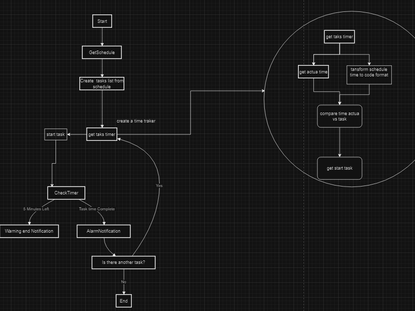

<section>

basic flow mermaid code:
graph TD
    Start --> GetSchedule
    GetSchedule --> CreateTaskList
    CreateTaskList --> StartTasks
    StartTask --> CheckTimer
    CheckTimer --5 Minutes Left--> WarningNotification
    CheckTimer --Task Complete--> AlarmNotification
    AlarmNotification --> NextTask[Is there another task?]
    NextTask --Yes--> StartTask
    NextTask --No--> End 
    
 </section>
<section>

Flow:

 </section>

